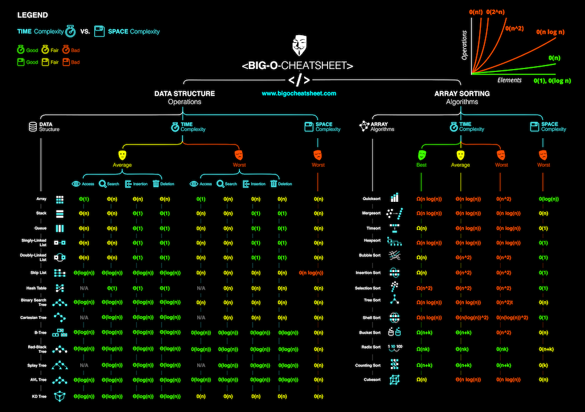

# Time complexity

## Best Case 

It is represented in \( $$\omega$$ \)

* Lower Bound of the cost
* Determined by "Easier Input"
* Provides a goal for all inputs

## Worst Case 

It is represented in \( O \)

* Upper bound on cost
* Determined by "Most difficult" input
* Provides a guarantee for all inputs

## Average Case 

It is represented in \( $$\theta$$ \)

* Expected cost for random input
* Need a model for "Random" input
* Provides a way to predict performance

## Reference

* [https://www.bigocheatsheet.com/](https://www.bigocheatsheet.com/)

